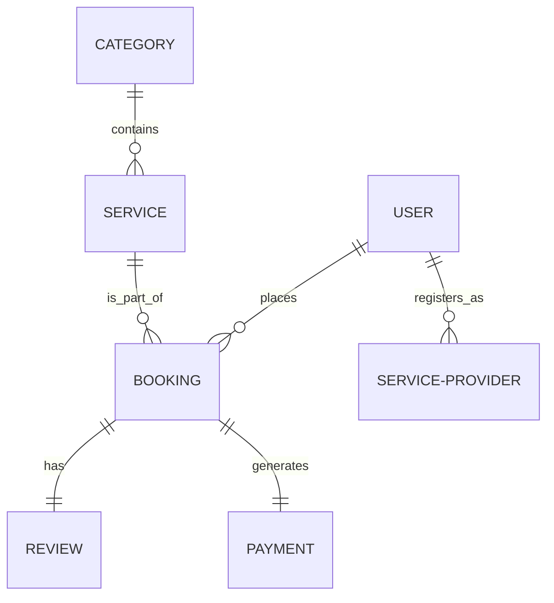

# Project Documentation: Local Service Provider Platform

## 1. Project Introduction
The **Local Service Provider Platform** is a web-based marketplace designed to simplify the process of finding and booking local services. Inspired by platforms like Urban Company, it connects skilled professionals (providers) such as plumbers, electricians, cleaners, and beauticians with customers who need these services at their doorstep. The system is built using the **MERN Stack** (MongoDB, Express.js, React, Node.js), ensuring a scalable, responsive, and real-time experience.

## 2. Purpose
The primary purpose of this project is to create a digital ecosystem that:
*   Provides customers with a secure and convenient way to book home services.
*   Empowers local service providers by giving them a platform to showcase their skills and manage their business.
*   Automates the administrative overhead of booking management, tracking, and payments.

## 3. Project Definition
The project is defined as an **Online Service Marketplace**. It enables role-based access for three primary user types:
1.  **Customers**: Can search, filter, and book services.
2.  **Service Providers**: Can list their expertise and manage bookings.
3.  **Administrators**: Can oversee the entire platform, manage users, and monitor transactions.

## 4. Objectives
*   **User Accessibility**: Provide a user-friendly interface for customers to find services within clicks.
*   **Efficient Matching**: Connect the right service provider with the right customer based on availability and specialty.
*   **Transparency**: Establish trust through a transparent Review and Rating system.
*   **Operational Control**: Give Admins full control over service categories, provider verification, and booking statuses.
*   **Financial Integrity**: Track bookings and commissions accurately.

## 5. Actors
*   **Customer**: The end-user who browses services, books appointments, and leaves reviews.
*   **Service Provider**: The professional who fulfills service requests and manages their professional profile.
*   **Admin / Super Admin**: The controller who manages the system settings, service categories, and users.

## 6. System Overview
The system follows a Client-Server architecture:
*   **Frontend**: Developed using **React.js** for a dynamic and responsive user interface.
*   **Backend**: Powered by **Node.js** and **Express.js** to handle API requests and business logic.
*   **Database**: **MongoDB** is used for its flexible schema-less structure, storing users, services, and booking data.
*   **Security**: Implements **JWT (JSON Web Tokens)** for secure authentication and role-based access control.

## 7. Modules of the Website
1.  **Authentication & Profile Module**: Handles Registration, Login, and Profile Management.
2.  **Service Catalog Module**: Manages service categories and individual service listings.
3.  **Booking & Scheduling Module**: The core logic for selecting dates, times, and confirming appointments.
4.  **Dashboard Module**: Role-specific dashboards (Admin, Provider, Customer) for specialized actions.
5.  **Review & Rating Module**: Allows customers to provide feedback on services.
6.  **Admin Management Module**: Tools for managing users, categories, and site-wide statistics.

## 8. Functionality of Each Module

### 8.1 Authentication & Profile
*   **Secure Sign-up/Login**: Users can register as a Customer or Provider.
*   **Profile Management**: Update contact details, profile pictures, and addresses.
*   **Password Security**: Password hashing and Reset functionality.

### 8.2 Service Catalog
*   **Categorization**: Services are grouped (e.g., Cleaning, Repairing, Salon).
*   **Filtering**: Customers can filter providers based on price and expert ratings.

### 8.3 Booking & Scheduling
*   **Reservation**: Customers pick a service, provider, date, and time.
*   **Status Tracking**: Real-time status updates (Pending → Accepted → Rejected → Completed).
*   **Address Management**: Selection/Input of the service location.

### 8.4 User Dashboards
*   **Customer Dashboard**: View active bookings and history.
*   **Provider Dashboard**: Accept/Reject incoming requests and view earnings.
*   **Admin Dashboard**: Manage user lists, add/remove service categories, and view platform metrics.

### 8.5 Review & Rating
*   **Feedback Loop**: Customers submit ratings (1-5 stars) and comments after service completion.
*   **Quality Assurance**: Helps other customers make informed decisions.

## 9. Data Design
The system uses a Document-Oriented data model.
*   **Users** are the central entity.
*   **Bookings** link a Customer, a Provider, and a Service together.
*   **Services** belong to specific **Categories**.
*   **Reviews** are linked to both a Booking and a Provider.

## 10. Data Dictionary

### 10.1 User Entity (`users` collection)
| Field Name | Data Type | Description | Constraints |
| :--- | :--- | :--- | :--- |
| `_id` | ObjectId | Unique identifier for the user | Primary Key |
| `name` | String | Full name of the user | Required |
| `email` | String | Email address used for login | Unique, Required |
| `password` | String | Hashed password | Required |
| `role` | String | User role (customer/provider/admin) | enum, Default: customer |
| `phone` | String | Contact number | Optional |
| `status` | String | Account status (active/blocked) | enum, Default: active |

### 10.2 Booking Entity (`bookings` collection)
| Field Name | Data Type | Description | Constraints |
| :--- | :--- | :--- | :--- |
| `_id` | ObjectId | Unique identifier for booking | Primary Key |
| `customerId` | ObjectId | Reference to the User (customer) | Required, Foreign Key |
| `providerId` | ObjectId | Reference to the User (provider) | Required, Foreign Key |
| `serviceId` | ObjectId | Reference to the Service | Required, Foreign Key |
| `date` | String | Scheduled date | Required |
| `time` | String | Scheduled time | Required |
| `price` | Number | Total cost of service | Required |
| `status` | String | Booking status | enum (pending, accepted...) |

### 10.3 Service Entity (`services` collection)
| Field Name | Data Type | Description | Constraints |
| :--- | :--- | :--- | :--- |
| `_id` | ObjectId | Unique identifier for service | Primary Key |
| `name` | String | Name of the service | Required |
| `description` | String | Detailed description | Required |
| `price` | Number | Standard price | Required |
| `category` | String | Category name | Required |
| `image` | String | URL of service icon/image | Optional |

### 10.4 Review Entity (`reviews` collection)
| Field Name | Data Type | Description | Constraints |
| :--- | :--- | :--- | :--- |
| `_id` | ObjectId | Unique identifier | Primary Key |
| `bookingId` | ObjectId | Linked booking | Required, Foreign Key |
| `rating` | Number | Numerical score (1-5) | Required (1-5) |
| `comment` | String | Textual feedback | Optional |
